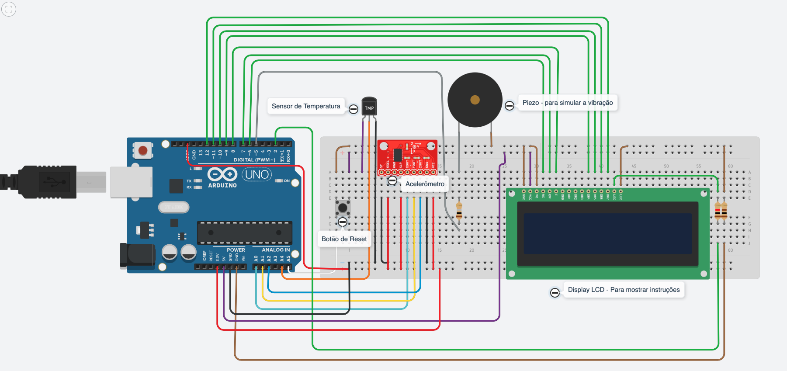

<h1 align="center">Projeto referente a disciplina de IOT, do MBA da FIAP - 36 SCJ</h1>

 

   <a href="#-tecnologias">Tecnologias</a>&nbsp;&nbsp;&nbsp;|&nbsp;&nbsp;&nbsp;
   <a href="#-projeto">Projeto</a>&nbsp;&nbsp;&nbsp;&nbsp;&nbsp;&nbsp;
 

 

    
 

 ## :rocket: Tecnologias

 Projeto de Internet of Things para Arduino, desenvolvido utilizando a plataforma <a href="https://www.tinkercad.com" target="_blank">Tinkercad</a> 

 ## 💻 Projeto

O projeto pode ser acessado e simulado diretamente na plataforma pelo <a href="https://www.tinkercad.com" target="_blank">link</a> (EM BREVE) 

 ---
<h4 align="center">
   Code and coffee ☕
</h4>

